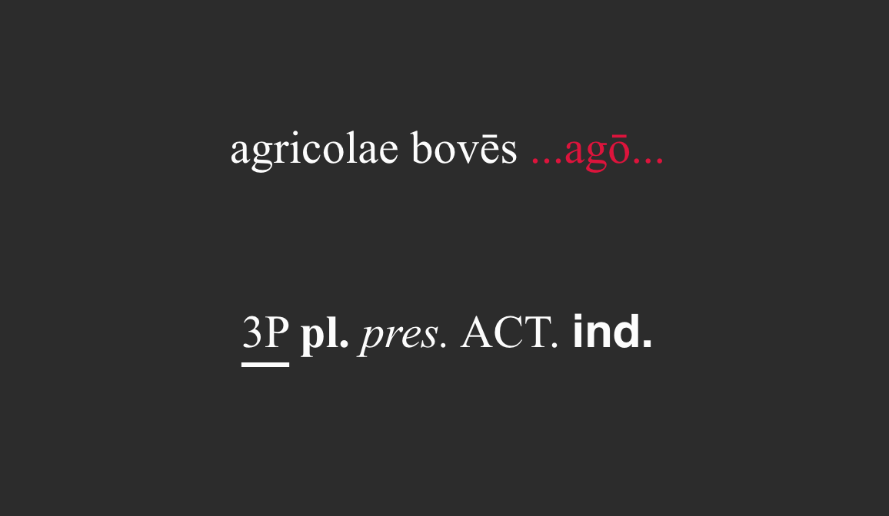
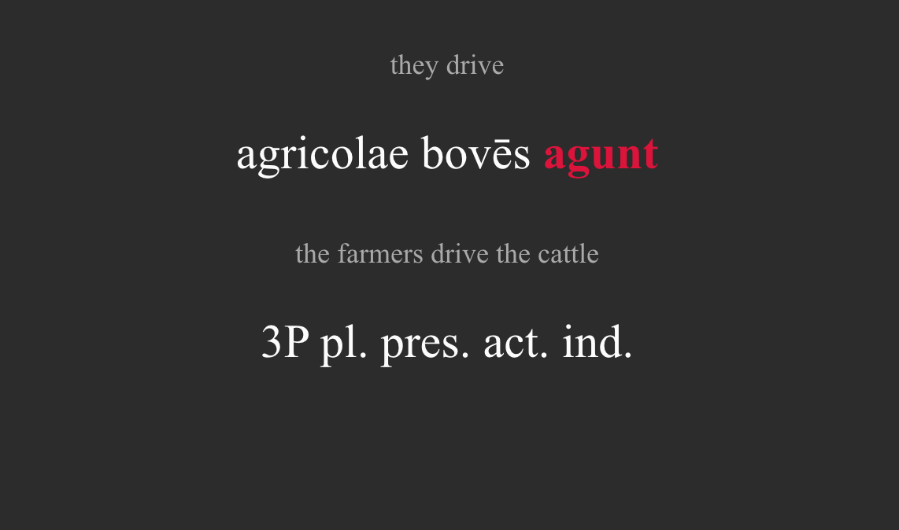

# LatinConjugations
CSV format flashcard deck for conjugation practice

Includes example sentences and morphology for most forms of the following 10 verbs in latin:

<pre>
- sum    - *be*      (Irregular)
- eō     - *go*      (Irregular)
- amō    - *love*    (1st Conjugation)
- dō     - *give*    (1st Conjugation w/ stem change)
- habeō  - *have*    (2nd Conjugation)
- agō    - *act*     (3rd Conjugation)
- audiō  - *hear*    (4th Conjugation)
- faciō  - *do/make* (Mixed 3rd/4th Conjugation)
- volō   - *want*    (Irregular)
- ferō   - *carry*   (Irregular)
</pre>

and greek:
<pre>
- εἰμί      - *to be*             (athematic/μι-verb)
- ἔχω       - *to have, hold*     (thematic/ω-verb)
- γίγνομαι  - *to become, happen* (middle deponent)
- δίδωμι    - *to give*           (athematic/μι-verb)
- ποιέω     - *to make, do*       (contract -έω verb)
- ὁράω      - *to see*            (contract -άω verb)
- λαμβάνω   - *to take, receive*  (nasal infix)
- δεῖ       - *it is necessary*   (impersonal defective)
- οἶδα      - *to know*           (perfect with present meaning)
- φέρω      - *to bear, carry*    (suppletive)
</pre>

Inspired to some extent by [the kofi method](https://www.asiteaboutnothing.net/w_kofi-french.php) and also my own frustration with remembering conjugations.

The idea is to use SRS to drill all conjugations for a small set of representative verbs, here I've selected 10 verbs, covering each regular conjugation, a regular conjugation with stem change, a mixed conjugation, and four extremely common irregular verbs in latin, and a wide selection of conjugations in greek. The original method uses more like 50 verbs to do this but modern languages tend to have much fewer forms, hence the restricted selection. 

These are auto-generated and NOT professionally checked, but hopefully good enough to brute force some gains in conjugation ability.

Example:

 
